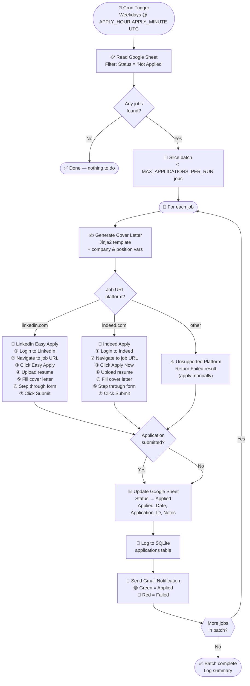
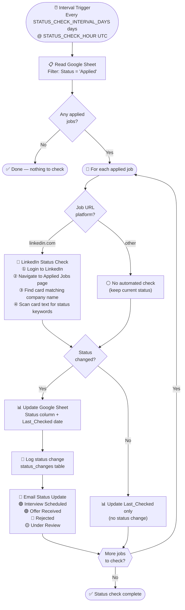
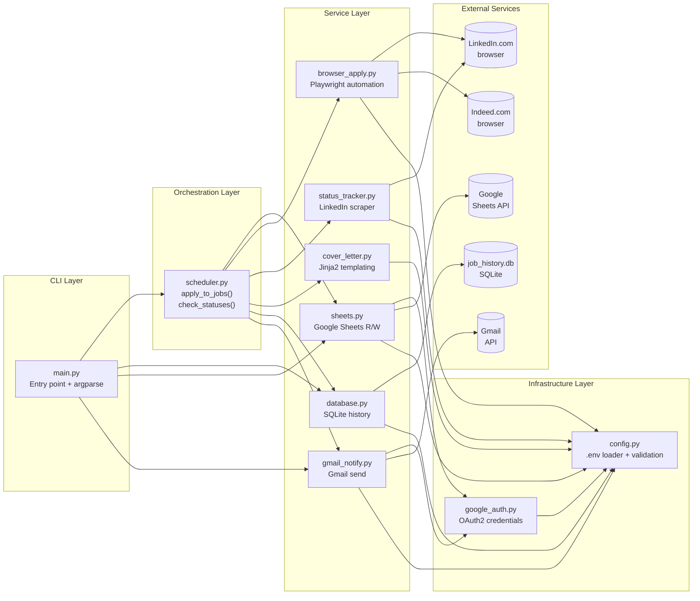
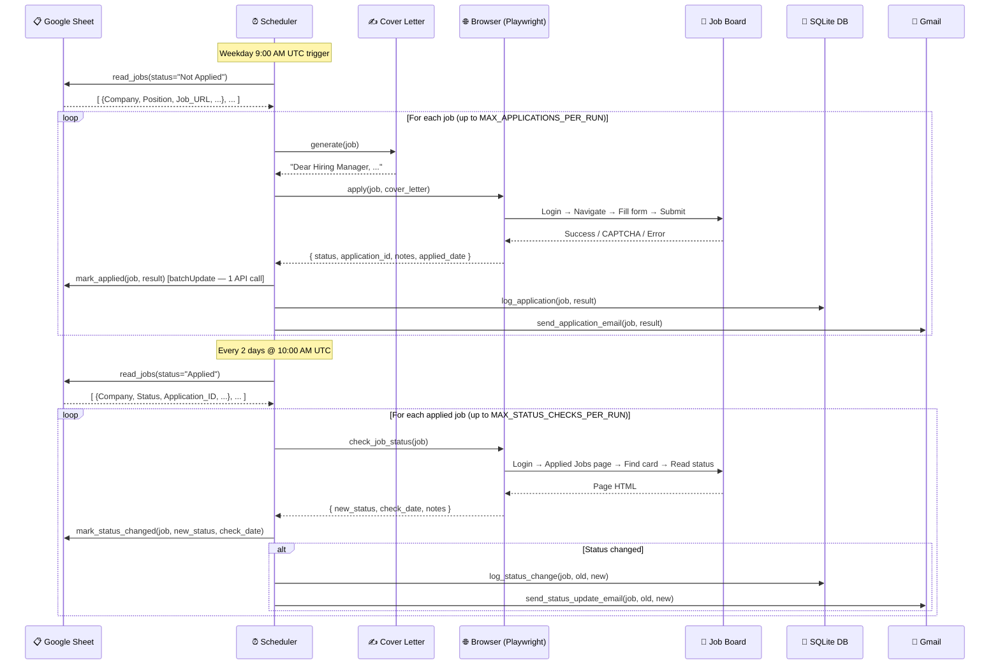
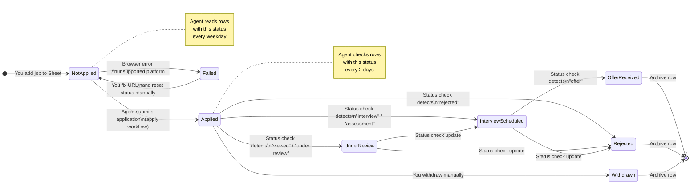
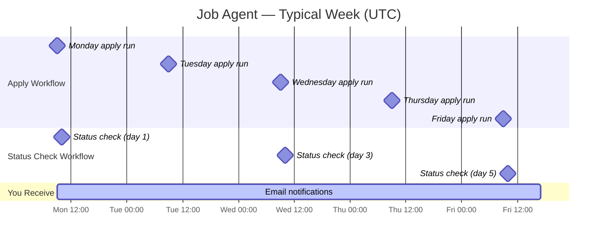

# Job Application Agent 🤖

A **free, self-hosted** Python agent that automates job applications end-to-end — no n8n, no subscriptions, no cloud required.

> Reads from Google Sheets → Applies via browser automation → Logs to SQLite → Notifies via Gmail

---

## Table of Contents

- [How It Works](#how-it-works)
- [Agent Flows](#agent-flows)
  - [Daily Apply Workflow](#daily-apply-workflow)
  - [Status Check Workflow](#status-check-workflow)
- [Architecture](#architecture)
  - [Component Map](#component-map)
  - [Data Flow](#data-flow)
- [Job Status Lifecycle](#job-status-lifecycle)
- [Scheduler Timeline](#scheduler-timeline)
- [Google Sheet Schema](#google-sheet-schema)
- [Configuration Reference](#configuration-reference)
- [CLI Commands](#cli-commands)
- [Project Structure](#project-structure)
- [Quick Start](#quick-start)
- [Security Notes](#security-notes)

---

## How It Works

At its core the agent runs two recurring workflows on a cron-like schedule — equivalent to two n8n workflow tabs running in parallel:

| Workflow | Trigger | What it does |
|---|---|---|
| **Apply** | Weekdays at `APPLY_HOUR:APPLY_MINUTE` UTC | Reads pending jobs → generates cover letters → applies via browser |
| **Status Check** | Every `STATUS_CHECK_INTERVAL_DAYS` days | Re-visits applied jobs → scrapes status → emails you if anything changed |

Everything is driven by a single Google Sheet you maintain. You add job URLs, the agent does the rest.

---

## Agent Flows

### Daily Apply Workflow

This mirrors a typical n8n workflow with a Cron trigger → HTTP/browser nodes → Google Sheets node → Gmail node.



---

### Status Check Workflow

Runs every N days to detect if recruiters have viewed, rejected, or progressed your applications.



---

## Architecture

### Component Map

Shows how the 9 source modules depend on each other and what external services each touches.



---

### Data Flow

End-to-end path of data from your Google Sheet to your Gmail inbox.



---

## Job Status Lifecycle

A job moves through these states, driven by agent actions or manual edits.



---

## Scheduler Timeline

How the two workflows interleave across a typical work week.



---

## Google Sheet Schema

The agent reads from and writes to a sheet tab named **`Jobs`** (exact spelling).

```
┌─────┬───────────┬──────────────────┬──────────────────┬─────────────┬──────────────┬──────────────────────┬──────────────────────────┬────────────────────────────────────┬──────────┐
│  A  │     B     │        C         │        D         │      E      │      F       │          G           │            H             │                 I                  │    J     │
├─────┼───────────┼──────────────────┼──────────────────┼─────────────┼──────────────┼──────────────────────┼──────────────────────────┼────────────────────────────────────┼──────────┤
│ ID  │  Company  │    Position      │     Status       │Applied_Date │ Last_Checked │   Application_ID     │          Notes           │              Job_URL               │ Priority │
├─────┼───────────┼──────────────────┼──────────────────┼─────────────┼──────────────┼──────────────────────┼──────────────────────────┼────────────────────────────────────┼──────────┤
│ 001 │ Acme Corp │ Software Eng.    │ Not Applied      │             │              │                      │                          │ https://linkedin.com/jobs/view/123 │ High     │
│ 002 │ Beta Ltd  │ Product Manager  │ Applied          │ 2026-02-20  │ 2026-02-22   │ AUTO_20260220091532  │ Submitted via Easy Apply │ https://indeed.com/j/abc456        │ Medium   │
│ 003 │ Gamma Inc │ Data Scientist   │ Under Review     │ 2026-02-18  │ 2026-02-22   │ AUTO_20260218091104  │ Status checked via LI    │ https://linkedin.com/jobs/view/789 │ High     │
└─────┴───────────┴──────────────────┴──────────────────┴─────────────┴──────────────┴──────────────────────┴──────────────────────────┴────────────────────────────────────┴──────────┘
```

### Column Reference

| Col | Name | Set By | Description |
|-----|------|--------|-------------|
| A | `Job_ID` | You | Unique ID you assign (e.g. `001`, `acme-swe`) |
| B | `Company` | You | Company name — used in cover letter and email subject |
| C | `Position` | You | Job title — used in cover letter |
| D | `Status` | Agent + You | `Not Applied` → `Applied` → `Under Review` → ... |
| E | `Applied_Date` | Agent | Set automatically when the application is submitted |
| F | `Last_Checked` | Agent | Updated on every status-check pass |
| G | `Application_ID` | Agent | Platform reference ID (e.g. `AUTO_20260220091532`) |
| H | `Notes` | Agent | Auto-filled with apply result or status check notes |
| I | `Job_URL` | You | Full LinkedIn or Indeed job URL |
| J | `Priority` | You | `High` / `Medium` / `Low` — informational only |

### Valid Status Values

```
Not Applied  →  Applied  →  Under Review  →  Interview Scheduled  →  Offer Received
                                          ↘                        ↘
                                           Rejected                 Rejected
                                           Withdrawn
```

---

## Configuration Reference

Copy `.env.example` to `.env` and fill in your values.

| Variable | Required | Default | Description |
|----------|----------|---------|-------------|
| `GOOGLE_SHEET_ID` | ✅ | — | Sheet ID from the Google Sheets URL |
| `USER_EMAIL` | ✅ | — | Your Gmail address (send + receive notifications) |
| `GOOGLE_CREDENTIALS_PATH` | | `credentials.json` | Path to your OAuth2 credentials file |
| `RESUME_LOCAL_PATH` | ✅ | — | Absolute path to your resume PDF |
| `RESUME_URL` | | `""` | Google Drive link to resume (informational) |
| `LINKEDIN_EMAIL` | For LinkedIn | `""` | LinkedIn login email |
| `LINKEDIN_PASSWORD` | For LinkedIn | `""` | LinkedIn password |
| `INDEED_EMAIL` | For Indeed | `""` | Indeed login email |
| `INDEED_PASSWORD` | For Indeed | `""` | Indeed password |
| `APPLY_HOUR` | | `9` | Hour to run apply workflow (UTC, 0–23) |
| `APPLY_MINUTE` | | `0` | Minute to run apply workflow (0–59) |
| `STATUS_CHECK_INTERVAL_DAYS` | | `2` | Days between status checks (≥ 1) |
| `STATUS_CHECK_HOUR` | | `10` | Hour to run status checks (UTC, 0–23) |
| `MAX_APPLICATIONS_PER_RUN` | | `5` | Max jobs applied per daily run |
| `MAX_STATUS_CHECKS_PER_RUN` | | `20` | Max jobs checked per status-check run |
| `DRY_RUN` | | `false` | `true` = log only, never actually apply |

---

## CLI Commands

```
python main.py                    Start the continuous scheduler (normal mode)
python main.py --dry-run          Same, but never submit — logs what it would do
python main.py --run-now          Apply to pending jobs right now (skip schedule)
python main.py --check-now        Check all applied job statuses right now
python main.py --test-email       Send a test email to verify Gmail is working
python main.py --list-jobs        Print all pending jobs from the sheet and exit
```

Flags can be combined:
```
python main.py --dry-run --run-now    # safe preview of what apply would do
python main.py --dry-run --check-now  # safe preview of what status check would do
```

---

## Project Structure

```
Job-Agent/
│
├── main.py                    CLI entry point — argument parsing + startup
├── scheduler.py               Two workflow functions + APScheduler setup
├── config.py                  All settings loaded from .env, with validation
│
├── sheets.py                  Google Sheets read/write (batchUpdate for atomic writes)
├── gmail_notify.py            Gmail API — application + status update emails
├── browser_apply.py           Playwright automation — LinkedIn & Indeed apply flows
├── status_tracker.py          LinkedIn Applied Jobs page scraper
├── cover_letter.py            Jinja2 cover letter renderer
├── database.py                SQLite history log (applications + status_changes)
├── google_auth.py             Shared OAuth2 credential loader (used by sheets + gmail)
│
├── cover_letter_template.txt  ← Edit this with your personal cover letter
├── sheet_template.csv         Import into Google Sheets to create the Jobs tab
├── .env.example               Copy to .env and fill in your credentials
│
├── requirements.txt
├── Procfile                   Heroku/Railway worker process definition
├── railway.toml               Railway.app deployment config
├── nixpacks.toml              Build config (Chromium system deps)
├── start.py                   Railway startup — writes secrets from env to disk
│
├── SETUP.md                   Step-by-step setup guide
│
└── tests/
    ├── conftest.py            Shared fixtures, env stubs, DB isolation
    ├── test_cover_letter.py   Cover letter generation tests
    ├── test_database.py       SQLite log tests
    └── test_sheets.py         Google Sheets integration tests (mocked)
```

---

## Quick Start

```bash
# 1. Install
pip install -r requirements.txt
playwright install chromium

# 2. Configure
cp .env.example .env
# Edit .env with your Google Sheet ID, email, resume path, and job board credentials

# 3. First-run auth (opens browser for Google OAuth)
python main.py --list-jobs

# 4. Dry run — see what would happen without applying
python main.py --dry-run --run-now

# 5. Start the scheduler
python main.py
```

See **[SETUP.md](SETUP.md)** for the full step-by-step guide including Google Cloud setup.

---

## Local Database

The agent keeps a permanent local history in `job_history.db` (SQLite).

**`applications` table** — one row per application attempt:

```
id | job_id | company | position | platform | status | application_id | notes | applied_at | created_at
```

**`status_changes` table** — one row per detected status change:

```
id | job_id | company | position | old_status | new_status | changed_at | created_at
```

This gives you a full audit trail even if you modify the Google Sheet manually.

---

## Cover Letter Customisation

Edit `cover_letter_template.txt`. Available Jinja2 variables:

| Variable | Default | Source |
|----------|---------|--------|
| `{{ company }}` | `"the company"` | Sheet: Company column |
| `{{ position }}` | `"the position"` | Sheet: Position column |
| `{{ applicant_name }}` | `"Your Name"` | Set in template or `extra_context` |
| `{{ skills }}` | `"software development"` | Set in template or `extra_context` |

Example template:
```
Dear Hiring Manager at {{ company }},

I am excited to apply for the {{ position }} role. With my background in
{{ skills }}, I am confident I can contribute meaningfully to your team.

Best regards,
{{ applicant_name }}
```

---

## Supported Platforms

| Platform | Apply | Status Check | Notes |
|----------|-------|--------------|-------|
| **LinkedIn** | ✅ Easy Apply | ✅ Applied Jobs page | Non-headless: CAPTCHA can be solved manually |
| **Indeed** | ✅ Indeed Apply | ❌ Not yet implemented | Two-step login handled automatically |
| **Other** | ❌ Skip + log | ❌ N/A | Returns `Failed` result; apply manually |

---

## Security Notes

- `credentials.json`, `.env`, and `token.json` are in `.gitignore` — they are never committed
- All Google API calls use OAuth2 with the minimum required scopes (Sheets + Gmail send only)
- The SQLite database (`job_history.db`) stays on your machine
- Passwords are stored only in your local `.env` file; nothing is sent to third parties
- For deployment to Railway/Heroku, credentials are passed as environment variables (not files)

---

## Running Tests

```bash
pytest tests/ -v
```

All 12 tests run without real Google credentials or a browser — everything external is mocked.

---

## Deployment (Railway / Heroku)

Set these environment variables in your Railway/Heroku dashboard (instead of `.env`):

- All variables from the [Configuration Reference](#configuration-reference) above
- `GOOGLE_CREDENTIALS_JSON` — paste the full contents of `credentials.json`
- `GOOGLE_TOKEN_JSON` — paste the full contents of `token.json` (generated on first local run)

The `start.py` script writes these to disk before launching `main.py`.

---

*Built as a free alternative to n8n job automation workflows. No subscriptions, no cloud, no scraping APIs.*
